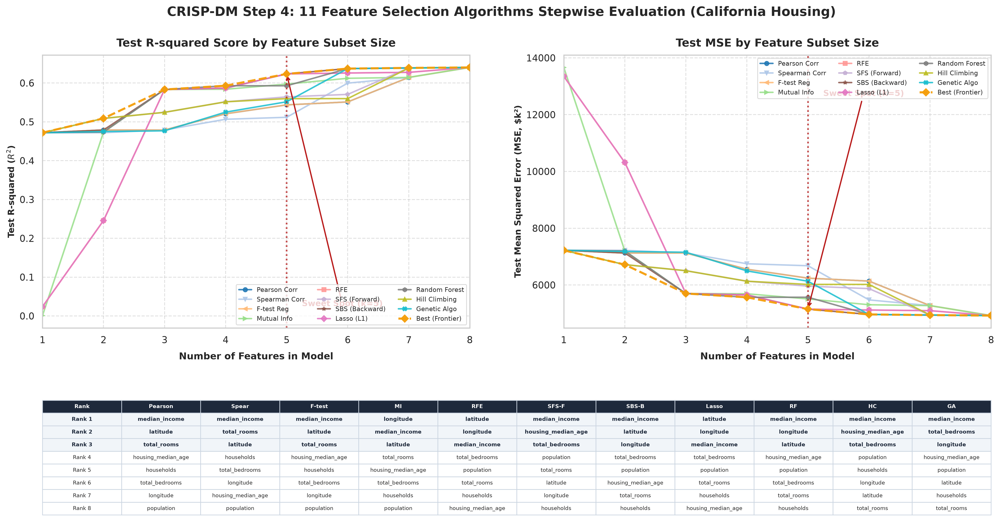
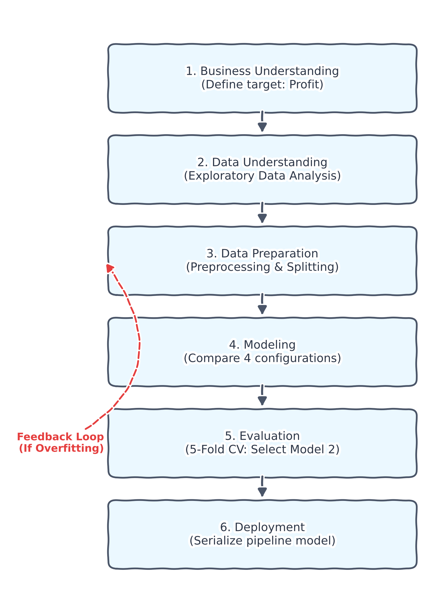

# Homework 7: L7-Multiple Linear Regression Workflow

**Date:** June 15, 2026  
**Subject:** Boston Housing CRISP-DM sklearn Project (Version v1)  
**Author:** AI Pair Programmer (Antigravity)

---

## 1. Project Overview & Deliverables
Today, we implemented a complete, modular Scikit-learn regression solution following the CRISP-DM process to predict Boston housing median values (`medv` in $1000s). The project workspace now contains the following core files:

1. **`solve_boston_housing_crispdm.py`**: The main execution orchestrator containing all modular functions (`data_understanding`, `build_pipeline`, `evaluate_train_test`, `evaluate_cross_validation`, `run_model_experiments`, `select_final_model`, `deployment_simulation`, `save_model`).
2. **`boston_housing_model.pkl`**: The serialized final pipeline (preprocessor + regression weights) saved using `joblib`.
3. **`feature_selection_performance_allinone.png`**: A unified comparison plot evaluating all 9 top feature selection algorithms (SFS, SBS, RFE, SelectKBest/F-Test, Pearson, Spearman, Mutual Info, Lasso, and Random Forest) along with their respective feature rankings.

---

## 2. Core CRISP-DM Modeling Results
We trained and compared four model configurations using 5-Fold Cross-Validation (CV) and an 80/20 train-test split (`random_state=42`):

* **Model 1: rm Only**  
  * Test $R^2$ Score: `0.370757` | Test RMSE: `$6.79k` | CV $R^2$ Mean: `0.473312`
* **Model 2: rm + lstat**  
  * Test $R^2$ Score: `0.573958` | Test RMSE: `$5.59k` | CV $R^2$ Mean: `0.623752`
* **Model 3: rm + lstat + ptratio**  
  * Test $R^2$ Score: `0.630253` | Test RMSE: `$5.21k` | CV $R^2$ Mean: `0.664056`
* **Model 4: All Features (Selected Deployed Model)**  
  * Test $R^2$ Score: **`0.668759`** | Test RMSE: **`$4.93k`** | CV $R^2$ Mean: **`0.715222`**

### Model Selection Justification:
* **The Complexity Lift**: Unlike the tiny 50-row startups dataset where more features led to severe overfitting, the 506-row Boston Housing dataset is large enough to benefit from all features. Moving from Model 3 to Model 4 increases the CV $R^2$ from **0.6641 to 0.7152** and decreases the CV RMSE mean from **$5.27k to $4.84k** while remaining highly stable (CV $R^2$ standard deviation is only **0.0375**).
* **Final Model Equation** (refitted on all 506 observations using standardized features):
  $$\text{medv} = 22.53 - 0.93 \times \text{crim} + 1.08 \times \text{zn} + 0.14 \times \text{indus} + 0.68 \times \text{chas} - 2.06 \times \text{nox} + 2.67 \times \text{rm} + 0.02 \times \text{age} - 3.10 \times \text{dis} + 2.66 \times \text{rad} - 2.08 \times \text{tax} - 2.06 \times \text{ptratio} + 0.85 \times \text{b} - 3.74 \times \text{lstat}$$
* **Deployment Simulation**: For a new property profile with `crim` = 0.1, `zn` = 12.5, `indus` = 7.8, `chas` = 1, `nox` = 0.53, `rm` = 6.5, `age` = 65.0, `dis` = 4.0, `rad` = 4, `tax` = 300, `ptratio` = 18.0, `b` = 396.9, `lstat` = 12.0, the model predicts a median house value of **`$27,139.66`**.

---

## 3. Advanced Feature Selection Comparison
We implemented and plotted **all 9 top feature selection algorithms** in a unified comparison visual ([feature_selection_performance_allinone.png](file:///d:/Huan/Chen/L6/feature_selection_performance_allinone.png)):

| Rank | Pearson | Spearman | F-test | Mutual Info | RFE | SFS (Fwd) | SBS (Bwd) | Lasso (L1) | Random Forest |
| :---: | :--- | :--- | :--- | :--- | :--- | :--- | :--- | :--- | :--- |
| **1** | **lstat** | **lstat** | **lstat** | **lstat** | **lstat** | **lstat** | **lstat** | **lstat** | **lstat** |
| **2** | **rm** | **rm** | **rm** | **rm** | **rm** | ptratio | ptratio | dis | **rm** |
| **3** | ptratio | indus | ptratio | indus | ptratio | dis | dis | **rm** | dis |
| **4** | indus | nox | indus | nox | dis | nox | nox | rad | crim |
| **5** | tax | tax | tax | ptratio | nox | zn | rad | ptratio | nox |

---

## 4. CRISP-DM Machine Learning Workflow Diagram
Below is the workflow implemented in today's solution. You can also import the generated [workflow.drawio](./workflow.drawio) directly into Draw.io to view and edit it.

