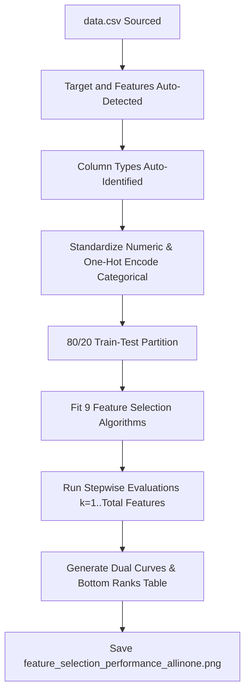

# L7-Multiple Linear Regression Workflow

This document explains how to use the automated, general-purpose machine learning pipeline to run feature selection analysis on any custom tabular dataset.

---

## 🛠️ Step-by-Step Instructions

To evaluate feature selection algorithms and plot the Test MSE vs. Feature Subset Size on your own dataset, follow these simple steps:

### 1. Place Your Data
Put your custom dataset in the project workspace directory and name it **`data.csv`**. 
- The dataset must contain numerical features. It can also contain categorical/text features.
- By default, the script will look for target columns named `medv` or `Profit`. If neither exists, it will automatically select the **last column** of your dataset as the continuous regression target.

### 2. Run the Workflow
Execute the general-purpose pipeline script:
```bash
python run_workflow.py
```

### 3. Review the Results
Once complete, the script will save a publication-quality plot in the workspace named:
**`feature_selection_performance_allinone.png`**

---

## ⚙️ Automated Pipeline Phases

The `run_workflow.py` script automatically manages the entire CRISP-DM Step 3 & 4 data preparation and modeling lifecycle:



### Key Phases:
1. **Target and Feature Auto-Detection**: Detects targets (`medv`, `Profit`, or last column) and splits the features.
2. **Column Type Identification**: Auto-separates numeric variables and categorical text variables.
3. **Data Preparation Pipeline**: standardizes all numeric columns via `StandardScaler` to put coefficients on the same scale, and encodes categorical columns via `OneHotEncoder(drop='first', handle_unknown='ignore')`.
4. **Train-Test Split**: Performs a standard 80/20 split using a fixed seed (`random_state=42`) for reproducibility.
5. **9-Algorithm Feature Selection Ranking**: Runs and ranks features across Filter, Wrapper, and Embedded methods:
   - Pearson Correlation
   - Spearman Correlation
   - F-test Regression Score
   - Mutual Information Score
   - Recursive Feature Elimination (RFE)
   - Sequential Forward Selection (SFS)
   - Sequential Backward Selection (SBS)
   - Lasso L1 coefficients
   - Random Forest Feature Importances
6. **Stepwise Modeling (from 1 to All Features)**: Fits multiple linear regression models starting from the top 1 feature up to the total number of features in the dataset, recording the Test R-squared and Test MSE at each step.
7. **Unified Visualization**: Generates a plot containing:
   - **Subplot 1**: Test R-squared score curves.
   - **Subplot 2**: Test Mean Squared Error (MSE) curves.
   - **Bottom Table**: The ranking of the features for each of the 9 selectors.

---

## 📈 Interpretation Guidelines
- **Elbow Point (Sweet Spot)**: Look at the Test MSE subplot. The feature subset size $k$ where the MSE curve bends and begins to level off represents the optimal number of features to use. Adding features beyond this elbow increases model complexity without yielding meaningful gains in predictive performance.
- **Frontier Path (Orange Dotted Line)**: The orange dotted line represents the performance ceiling at each feature size $k$. It shows the lowest MSE (or highest R-squared) achievable at that specific feature count.
